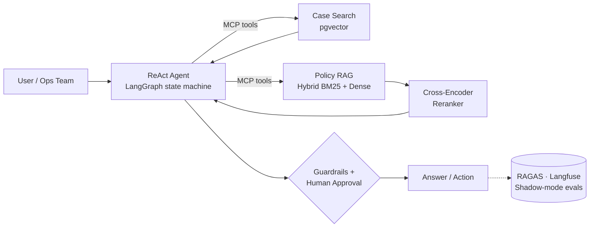

<h1 align="center">Hi 👋, I'm Om Jaiswal</h1>
<h3 align="center">AI Engineer · Agentic AI · RAG · Full-Stack</h3>

  

  
  
  
  

---

## 👨‍💻 About Me

AI Engineer with **2.3+ years** building agentic AI, RAG and full-stack systems that hold up in production.

- 🧠 Built the **AI layer of a live internal CRM** serving **10,000+ vehicle-transfer cases** for **8,000+ customers**
- 🔍 Semantic case search: **5–10 min of manual lookup → under 1 second**
- 📈 Lifted end-to-end **RAGAS score from 0.60 → 0.93** with better chunking + cross-encoder reranking
- 🛡️ Ship behind **eval harnesses, guardrails and shadow-mode promotion gates**
- 🏗️ Own the full stack: async FastAPI on AWS → React / TypeScript / React Native

---

## 🏗️ How I Build AI Systems

---

## 🛠️ Tech Stack

<b>🤖 Agentic & LLM</b>

 

ReAct tool-calling loops · agent state machines · structured outputs · guardrails · human-in-the-loop escalation · prompt engineering

<b>🔎 RAG & Retrieval</b>

 

Hybrid search (dense + BM25) · chunking strategies · cross-encoder reranking · semantic-layer RAG · NL2Query · embeddings

<b>📊 Evals, Observability & MLOps</b>

 

Gold datasets · faithfulness / context precision / recall scoring · regression tracking · shadow-mode evaluation

<b>⚙️ Backend, Full-Stack & Cloud</b>

 

Django · Express · REST / GraphQL · React Native · Expo · AWS (EC2, S3, Lambda, RDS, SageMaker) · GCP · Modal · RunPod

<b>🧪 ML, CV & Data</b>

 

PyTorch · TensorFlow · scikit-learn · XGBoost · LightGBM · Hugging Face · ViT · YOLO · OpenCV · MediaPipe · OCR · INT8/PTQ quantization · ExecuTorch · Airflow · Spark · dbt · Metabase

<b>🤝 Automation</b>

 

n8n · Gumloop · Make · Power Automate · Playwright · Puppeteer · Scrapy · Selenium

---

## 🌟 Featured Projects

| Project | What it does | Stack | Link |
|---|---|---|---|
| 🤖 **Inbox Agent** | Multi-tenant LangGraph agent over Gmail & Calendar. Defense-in-depth guardrails (prompt-injection tagging, recipient re-verification before send), human-approval node, 13-case eval harness gating CI on safety violations | Python · FastAPI · LangGraph · Groq · MongoDB · OAuth 2.0 | [GitHub](https://github.com/omjaiswal45/MailCalendarAgent) |
| 🗄️ **QueryPilot** | Enterprise Text-to-SQL copilot. Multi-agent LangGraph pipeline; pgvector schema-retrieval narrows a 500-table / ~25k-column DB to the relevant tables per question; sqlglot validates SQL safety | FastAPI · PostgreSQL · pgvector · LangGraph · Claude API · sqlglot | [GitHub](https://github.com/omjaiswal45) |
| 🧠 **Syntrix-AI** | Production-grade multi-agent platform: agents plan, call tools, critique and synthesize, with a full RAG pipeline | FastAPI · LangGraph · LangChain · Qdrant · Redis · Celery · WebSockets · Docker | [GitHub](https://github.com/omjaiswal45/Syntrix-AI-platform) |
| 🎓 **CollegeHuntin** | Live college-discovery startup platform with streaming AI chatbot (Groq LLaMA 3.3 70B), JWT auth, admin routes | Node.js · React · Next.js · MongoDB · Groq · LangGraph | [Live](https://www.collegehuntin.com/) |
| 🎥 **VideoTube** | YouTube clone, infinite scroll, nested comments | React · Tailwind · Redux | [Live](https://video-tube-orpin.vercel.app/) |
| 💬 **VaaniSetu** | Real-time chat, online presence, Socket.io | MERN · Socket.io · Zustand | [Live](https://chat-app-qjn5.onrender.com/) |

More projects

| Project | Stack | Link |
|---|---|---|
| 📋 **ProjectPilot**: task manager, JWT, Google Auth, email alerts | MERN · Redux Toolkit · Nodemailer | [Live](https://project-pilot-om-jaiswals-projects-56697ee4.vercel.app/) |
| 📄 **CertiSure**: certificate generator with PWA | MERN · JWT | [Live](https://certisure.vercel.app/) |

---

## 💼 Experience

<b>Software Engineer (AI/ML Specialist), Car Wizard Pvt. Ltd. (VahanHelp)</b> · May 2024 – Aug 2026

 

- Owned the **AI layer of the internal CRM**: agent runtimes, retrieval, evals and deployment, used by ops/support to process **10,000+ RC-transfer cases** for **8,000+ customers and dealers**
- Built **semantic case-similarity search** (OpenAI `text-embedding-3-small` → PostgreSQL/pgvector behind FastAPI): closest past cases in **<1s vs 5–10 min** of manual MongoDB lookup
- Shipped a **conversational RAG policy assistant** (RTO transfer rules + SOPs) via ReAct tool-calling agents and LangGraph state machines, exposed as **MCP tools**
- Fixed an underperforming retrieval layer with advanced chunking + cross-encoder reranking: **RAGAS 0.60 → 0.93**
- Built **ParivahanMitra CRM** (RBAC, BullMQ jobs, SLA-based routing, real-time React dashboards) and cut a slow query from **60s+ → under 2s** with compound indexes
- Owned architecture and AWS EC2 deployment of the live **VahanHelp Play Store app** (React Native, OTP auth, Razorpay)

<b>AI/ML Intern, DigiLocker</b> · Mar 2024 – May 2024

 

- Facial spoof-detection classifier via transfer learning: **96.4% accuracy**
- Anti-spoofing system (texture + depth cues): **EER under 2.5%** against photo/video/mask attacks

---

## 📊 GitHub Stats

  
  

  

  

---

## 🏆 Achievements

- 🥇 **National Finalist, KAVACH Cybersecurity Hackathon 2023** (Ministry of Education, GoI): phishing detection
- 🧩 **CodeChef max rating 1900+**, 250+ DSA problems on LeetCode/GeeksforGeeks
- 🚀 Multiple production apps live: VahanHelp (Play Store), CollegeHuntin, Syntrix-AI
- 🎓 B.Tech, Bundelkhand Institute of Engineering and Technology (2020–2024)

---

## 📫 Let's Connect

Open to **AI Engineer / Agentic AI / RAG** roles. Reach me at [omjai11022000@gmail.com](mailto:omjai11022000@gmail.com) or on [LinkedIn](https://www.linkedin.com/in/omjaiswal45/).

